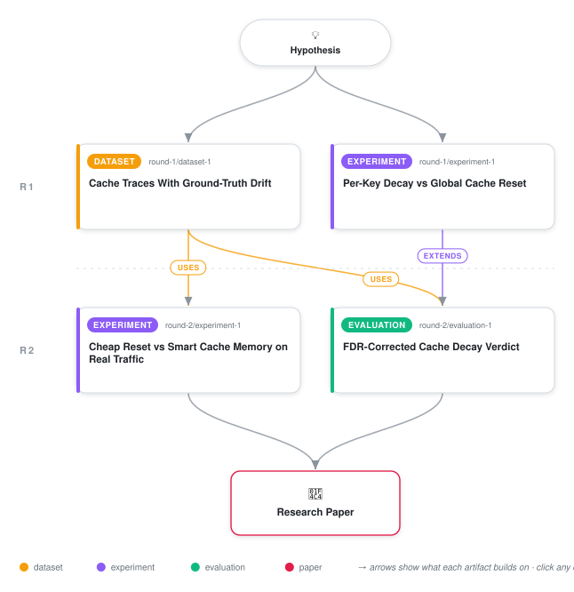

# Why Per-Key Cache Decay Rarely Beats a Cheaper Shorter Reset

<div align="center">

<a href="https://cdn.jsdelivr.net/gh/ai-inventor-outputs/ai-invention-b940ce-shadow-queue-admission-with-recency@fork/run_0pMem8W3ijCf/workflow.svg">
<picture>
  <source media="(prefers-color-scheme: dark)" srcset="workflow-dark.svg">
  
</picture>
</a>

<sub>🖱️ <b><a href="https://cdn.jsdelivr.net/gh/ai-inventor-outputs/ai-invention-b940ce-shadow-queue-admission-with-recency@fork/run_0pMem8W3ijCf/workflow.svg">Open the interactive diagram</a></b> — every card links to its artifact folder.</sub>

</div>

> **TL;DR** — This paper stress-tests a prior finding that per-key, coefficient-of-variation-based frequency decay improves TinyLFU-style cache-admission drift recovery in a narrow high-contention regime. The win-corner effect survives Benjamini-Hochberg correction for multiple testing, but two new targeted experiments substantially undercut it: a cheaper short-reset baseline matches or beats the per-key mechanism in 3 of the 4 win-corner drift scenarios, and the remaining advantage holds in only 12 of 36 nearby CoV-threshold choices. A real Twitter-trace replay confirms steady-state parity but, lacking labeled drift events, cannot independently confirm the recovery-time claim. Weighed against a corrected 5.14-5.68x memory cost and ~1.7-2.1x compute cost, the paper concludes per-key decay is not established as worth its overhead anywhere tested, and that shortening the existing global reset period captures most of the same benefit far more cheaply.

<details>
<summary>Full hypothesis</summary>

In a read-heavy key-value store with Zipf-skewed, drifting key popularity, a three-tier, CoV-classified per-key frequency-decay admission mechanism (as specified in the prior draft, with its M>=8-gap cold-start guard) does NOT deliver a net-beneficial recovery-time advantage over a merely SHORTENED single global TinyLFU reset period, once the comparison is (a) FDR-corrected across conditions, (b) checked against a short-reset ablation that sweeps the baseline's own reset multiplier down to 1x-2x cache capacity, and (c) checked for sensitivity to the CoV tier thresholds. At the one cell tested in depth (cache-to-key-space ratio=0.01, Zipf alpha=1.2, the 'win corner' of a 36-condition sweep), the false-discovery-corrected effect survives statistically, but a cheaper 1x-4x-multiplier global reset matches or beats the three-tier mechanism in 3 of its 4 drift scenarios, and the one scenario where per-key decay still wins (high-magnitude/high-frequency rank churn, ~9.5% faster recovery) holds in only 12 of 36 nearby CoV-threshold combinations -- i.e., is a narrow, untuned-hyperparameter-dependent result rather than a robust one. The mechanism also costs 5.14x-5.68x the baseline's memory (exceeding the pre-registered <=2x bound) and ~1.7-2.1x its per-request compute. On real Twitter production traffic (80,000 requests, cluster026) both estimators are steady-state-equivalent (within the pre-registered 1pp margin), giving no evidence either way on recovery speed since that trace carries no labeled drift. Because all three decisive follow-ups (short-reset ablation, threshold-sensitivity grid, real-trace check) were run at only ONE of nine (ratio, skew) cells, this hypothesis is now explicitly SCOPED: we have not established that per-key decay is dominated by short-reset everywhere, only at this one cell -- the blanket claim would overreach the evidence. The hypothesis for the next iteration is therefore twofold and testable cheaply (~80s/cell): (1) does the same short-reset-dominates pattern replicate at 2-3 additional (ratio, skew) cells, particularly other statistically-significant-but-not-yet-ablated groups from the 36-condition grid; and (2) within the per-key family itself, does the surviving high-magnitude/high-frequency advantage require the full three-tier CoV/EWMA machinery, or does a strictly cheaper per-key signal (a 2-tier collapse, or a binary hit-in-last-window flag instead of CoV of inter-arrival gaps) capture the same or more of that advantage at lower classification cost -- since if even the cheapest per-key variant cannot separate from short-reset once generalized, the entire per-key-granularity idea should be reported as a documented negative result for this design space rather than pursued further.

</details>

[](https://cdn.jsdelivr.net/gh/ai-inventor-outputs/ai-invention-b940ce-shadow-queue-admission-with-recency@fork/run_0pMem8W3ijCf/paper.pdf) [](https://github.com/ai-inventor-outputs/ai-invention-b940ce-shadow-queue-admission-with-recency/tree/fork/run_0pMem8W3ijCf/paper_latex)

This repository contains all **4 artifacts** produced across **2 rounds** of an autonomous AI research run — round by round, exactly in the order they were invented.

## Round 1

| Artifact | Type | Demo | Source | Builds on |
|----------|------|------|--------|-----------|
| **[Cache Traces With Ground-Truth Drift](https://github.com/ai-inventor-outputs/ai-invention-b940ce-shadow-queue-admission-with-recency/tree/fork/run_0pMem8W3ijCf/round-1/dataset-1)** | [](https://github.com/ai-inventor-outputs/ai-invention-b940ce-shadow-queue-admission-with-recency/tree/fork/run_0pMem8W3ijCf/round-1/dataset-1) | [](https://colab.research.google.com/github/ai-inventor-outputs/ai-invention-b940ce-shadow-queue-admission-with-recency/blob/fork/run_0pMem8W3ijCf/round-1/dataset-1/demo/data_code_demo.ipynb) | [](https://github.com/ai-inventor-outputs/ai-invention-b940ce-shadow-queue-admission-with-recency/tree/fork/run_0pMem8W3ijCf/round-1/dataset-1/src) | — |
| **[Per-Key Decay vs Global Cache Reset](https://github.com/ai-inventor-outputs/ai-invention-b940ce-shadow-queue-admission-with-recency/tree/fork/run_0pMem8W3ijCf/round-1/experiment-1)** | [](https://github.com/ai-inventor-outputs/ai-invention-b940ce-shadow-queue-admission-with-recency/tree/fork/run_0pMem8W3ijCf/round-1/experiment-1) | [](https://colab.research.google.com/github/ai-inventor-outputs/ai-invention-b940ce-shadow-queue-admission-with-recency/blob/fork/run_0pMem8W3ijCf/round-1/experiment-1/demo/method_code_demo.ipynb) | [](https://github.com/ai-inventor-outputs/ai-invention-b940ce-shadow-queue-admission-with-recency/tree/fork/run_0pMem8W3ijCf/round-1/experiment-1/src) | — |

## Round 2

| Artifact | Type | Demo | Source | Builds on |
|----------|------|------|--------|-----------|
| **[Cheap Reset vs Smart Cache Memory on Real Traffic](https://github.com/ai-inventor-outputs/ai-invention-b940ce-shadow-queue-admission-with-recency/tree/fork/run_0pMem8W3ijCf/round-2/experiment-1)** | [](https://github.com/ai-inventor-outputs/ai-invention-b940ce-shadow-queue-admission-with-recency/tree/fork/run_0pMem8W3ijCf/round-2/experiment-1) | [](https://colab.research.google.com/github/ai-inventor-outputs/ai-invention-b940ce-shadow-queue-admission-with-recency/blob/fork/run_0pMem8W3ijCf/round-2/experiment-1/demo/method_code_demo.ipynb) | [](https://github.com/ai-inventor-outputs/ai-invention-b940ce-shadow-queue-admission-with-recency/tree/fork/run_0pMem8W3ijCf/round-2/experiment-1/src) | <sub><i>uses:</i><br/>[dataset‑1&nbsp;(R1)](https://github.com/ai-inventor-outputs/ai-invention-b940ce-shadow-queue-admission-with-recency/tree/fork/run_0pMem8W3ijCf/round-1/dataset-1)</sub> |
| **[FDR-Corrected Cache Decay Verdict](https://github.com/ai-inventor-outputs/ai-invention-b940ce-shadow-queue-admission-with-recency/tree/fork/run_0pMem8W3ijCf/round-2/evaluation-1)** | [](https://github.com/ai-inventor-outputs/ai-invention-b940ce-shadow-queue-admission-with-recency/tree/fork/run_0pMem8W3ijCf/round-2/evaluation-1) | [](https://colab.research.google.com/github/ai-inventor-outputs/ai-invention-b940ce-shadow-queue-admission-with-recency/blob/fork/run_0pMem8W3ijCf/round-2/evaluation-1/demo/eval_code_demo.ipynb) | [](https://github.com/ai-inventor-outputs/ai-invention-b940ce-shadow-queue-admission-with-recency/tree/fork/run_0pMem8W3ijCf/round-2/evaluation-1/src) | <sub><i>extends:</i><br/>[experiment‑1&nbsp;(R1)](https://github.com/ai-inventor-outputs/ai-invention-b940ce-shadow-queue-admission-with-recency/tree/fork/run_0pMem8W3ijCf/round-1/experiment-1)<br/><i>uses:</i><br/>[dataset‑1&nbsp;(R1)](https://github.com/ai-inventor-outputs/ai-invention-b940ce-shadow-queue-admission-with-recency/tree/fork/run_0pMem8W3ijCf/round-1/dataset-1)</sub> |

## Repository Structure

Artifacts are grouped by the round of invention that produced them. Each
artifact has its own folder with source code and a self-contained demo:

```
.
├── round-1/                         # One folder per round of invention
│   ├── experiment-1/
│   │   ├── README.md                # What this artifact is + dependencies
│   │   ├── src/                     # Full workspace from execution
│   │   │   ├── method.py            # Main implementation
│   │   │   ├── method_out.json      # Full output data
│   │   │   └── ...                  # All execution artifacts
│   │   └── demo/                    # Self-contained demo
│   │       └── method_code_demo.ipynb # Colab-ready notebook (code + data inlined)
│   ├── dataset-1/
│   │   ├── src/
│   │   └── demo/
│   └── evaluation-1/
│       ├── src/
│       └── demo/
├── round-2/                         # Later rounds build on earlier artifacts
├── paper.pdf                        # Research paper
├── paper_latex/                     # LaTeX source files
├── chat/                            # Every prompt, response and tool call, per module
├── workflow.svg                     # Artifact dependency diagram (this page's header)
└── README.md
```

## Running Notebooks

### Option 1: Google Colab (Recommended)

Click the "Open in Colab" badges above to run notebooks directly in your browser.
No installation required!

### Option 2: Local Jupyter

```bash
# Clone the repo
git clone https://github.com/ai-inventor-outputs/ai-invention-b940ce-shadow-queue-admission-with-recency
cd ai-invention-b940ce-shadow-queue-admission-with-recency

# Install dependencies
pip install jupyter

# Run any artifact's demo notebook
jupyter notebook <artifact_folder>/demo/
```

## Source Code

The original source files are in each artifact's `src/` folder.
These files may have external dependencies - use the demo notebooks for a self-contained experience.

---
*Generated by AI Inventor Pipeline - Automated Research Generation*
